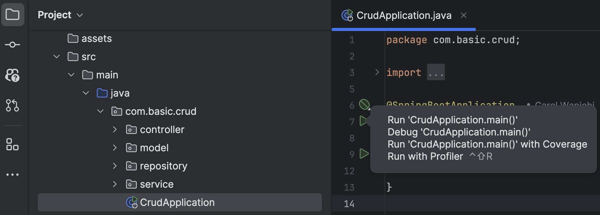

# CRUD with Springboot and MySQL

An introduction to Creating, Reading, Updating and Deleting data 
in a MySQL database using Springboot.
The tutorial used is 
[Getting Started with CRUD Operations in Spring Boot and MySQL: A Beginner's Guide](https://freedium.cfd/https://medium.com/linkit-intecs/getting-started-with-crud-operations-in-spring-boot-and-mysql-a-beginners-guide-756fd5b861d0)
on [Freedium](https://freedium.cfd/) by [Matheshyogeswaran](https://medium.com/@matheshyogeswaran).

## Project Architecture

This implements a modular design that enhances maintainability and scalability.
The division between the controller, service, and implementation layers enables 
better code organization and easier debugging. 

Additionally, it aligns with the principles of the Spring framework, 
facilitating the development of robust and efficient applications.

```md
src
├── main
│   ├── java
│   │   └── com
│   │       └── crud
│   │           ├── controller
│   │           │   └── UserController.java
│   │           ├── model
│   │           │   └── User.java
│   │           ├── repository
│   │           │   └── UserRepository.java
│   │           ├── service
│   │           │   ├── UserService.java
│   │           │   └── impl
│   │           │       └── UserServiceImpl.java
│   │           └── CrudApplication.java
│   ├── resources
│   │   ├── application.properties
│   │   └── static (for static resources like CSS and JS)
│   │   └── templates (for HTML templates if using server-side rendering)
│   └── sql (for database schema scripts)
└── test
```

The controller initiates API calls, which are then processed by the service layer. 
The service layer interfaces with the implementation layer to handle the actual business logic. 

This layered architecture contributes to the development of a more structured, maintainable 
and comprehensible CRUD application.

## Running the application
### Prerequisites
- Docker for the MySQL database
- Postman

#### Set up docker
1. Set up a collection in Postman
   - Import the [CRUD collection](./documents/postman-collection/CRUD.postman_collection.json) to Postman
2. Set up the MySQL database using docker
    - Always ensure that the MySQL database is running before starting the application
```shell
docker compose up -d
```
3. Run the application 
4. Run the collection in Postman
    - The collection contains the following requests:
        - Create a user
        - Get all users
        - Get a user by id
        - Update a user
        - Delete a user

## Resources
- [Getting Started with CRUD Operations in Spring Boot and MySQL: A Beginner's Guide](https://freedium.cfd/https://medium.com/linkit-intecs/getting-started-with-crud-operations-in-spring-boot-and-mysql-a-beginners-guide-756fd5b861d0)